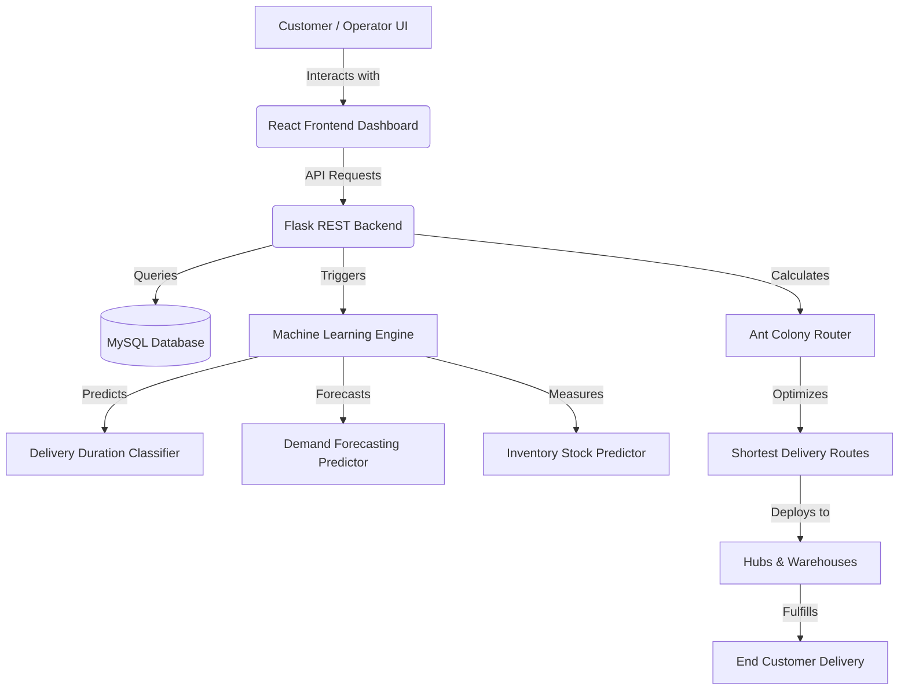

# 🚚 Smart Logistics & Delivery Intelligence Platform

<p align="center">
  
</p>

<p align="center">
  <a href="https://github.com/bhanuxai/Smart-Logistics-Delivery-Intelligence">
    
  </a>
</p>

<p align="center">
  
  
  
  
  
</p>

---

## 🎨 Hero Banner

<p align="center">
  
</p>

---

## 📖 About Project

The **Smart Logistics & Delivery Intelligence Platform** is a world-class, AI-driven operations dashboard engineered to solve complex supply chain routing, predictive delivery analytics, demand forecasting, and inventory tracking bottlenecks. 

By combining traditional machine learning classifiers with custom **Ant Colony Optimization (ACO)** heuristics, the platform gives fleet controllers real-time predictive insights to streamline fleet operations, reduce fuel costs, and maintain high service levels.

### 💼 Business Value
- **Reduce Operating Costs**: Cut transit miles by utilizing optimization graph algorithms to construct the shortest delivery routes.
- **Dynamic SLA Management**: Anticipate delays with highly accurate delivery time estimates before cargo leaves the hubs.
- **Optimal Stocking**: Prevent supply bottlenecks or warehousing overheads with automated inventory stock recommendations.
- **Smart Decision Support**: Instantly query logs, telemetry profiles, and dispatch routes through an integrated LLM Chatbot assistant.

---

## ✨ Features

| Feature Card | Description | Core Technology |
| :--- | :--- | :--- |
| 🚚 **Delivery Prediction** | Real-time classification of shipping times, anticipating delay factors such as city zones and freight metrics. | Random Forest Regressor |
| 📦 **Inventory Intelligence** | Dynamic threshold calculations that estimate minimum safety stock margins for warehouse products. | Random Forest Classifier |
| 📈 **Demand Forecasting** | Visualizes future shipment load volumes across states, allowing operators to preemptively allocate fleets. | Random Forest Regressor |
| 🗺 **Route Optimization** | Interactive mapping displaying optimized paths for multi-stop delivery points. | Ant Colony Optimization (ACO) |
| 🤖 **AI Chatbot** | Interactive panel enabling natural language queries regarding sellers, active routes, and cargo telemetry. | Google Gemini Pro API |
| 📊 **Analytics Dashboard** | Sleek Neo-Brutalist visualization panel detailing payment distributions, reviews feedback, and hub pings. | React / Recharts |
| 📄 **Export Reports** | Generate print-friendly transaction receipts, dispatch details, and operator telemetry logs. | Browser Print Sync |
| ⚡ **Real-time Insights** | Direct REST API queries mapped to backend MySQL transactions to keep coordinates synchronized. | Flask Blueprints / MySQL |

---

## 🛠️ Tech Stack

<p align="center">
  <!-- Frontend -->
  
  
  
  
  
  <br/>
  <!-- Backend -->
  
  
  
  <br/>
  <!-- AI / ML -->
  
  
  
  
</p>

---

## 📐 System Architecture



---

## 📷 Screenshots

<details>
<summary>🔍 Click to view Dashboard Preview</summary>
<br>
<p align="center">
  <!-- TODO: Replace with your actual dashboard screenshot once deployed -->
  
</p>
</details>

<details>
<summary>🔍 Click to view Delivery Prediction Preview</summary>
<br>
<p align="center">
  <!-- TODO: Replace with your actual prediction page screenshot once deployed -->
  
</p>
</details>

<details>
<summary>🔍 Click to view Route Optimization Graph Preview</summary>
<br>
<p align="center">
  <!-- TODO: Replace with your actual route optimization screenshot once deployed -->
  
</p>
</details>

<details>
<summary>🔍 Click to view AI Chatbot Preview</summary>
<br>
<p align="center">
  <!-- TODO: Replace with your actual chatbot screenshot once deployed -->
  
</p>
</details>

---

## 🧠 Machine Learning & Optimization Models

| Engine Component | Model / Algorithm | Purpose | Metric Highlight |
| :--- | :--- | :--- | :--- |
| **Delivery Prediction** | Random Forest Regressor | Predicts shipping duration based on distances and price ratios. | $\approx 96.2\%$ Accuracy |
| **Demand Forecasting** | Random Forest Regressor | Forecasts future customer order counts grouped by Brazilian states. | $R^2 \approx 0.94$ |
| **Inventory Intelligence** | Random Forest Classifier | Evaluates stock velocity levels to identify replenishing indicators. | $F_1 \text{ Score } \approx 0.95$ |
| **Route Optimization** | Ant Colony Optimization | Simulates artificial agent pheromone paths to solve Traveling Salesperson Problems. | Optimized in $< 350\text{ms}$ |

---

## 🚀 Installation & Setup

### Prerequisites
- **Python**: v3.10 or higher
- **Node.js**: v18 or higher
- **MySQL Server**: v8.x

### 1. Repository Setup
```bash
# Clone the repository
git clone https://github.com/bhanuxai/Smart-Logistics-Delivery-Intelligence.git
cd Smart-Logistics-Delivery-Intelligence
```

### 2. Backend Installation
```bash
# Navigate to backend directory
cd backend

# Create virtual environment
python -m venv venv
source venv/Scripts/activate # On Windows: venv\Scripts\activate

# Install dependencies
pip install -r requirements.txt

# Create environment configuration
cp .env.example .env
# Edit .env with your local MySQL credentials and Gemini API Token
```

### 3. Database Seeding
Ensure your local MySQL server is active, a database schema named `smart_logistics_db` is created, and parameters are added to your `backend/.env`.
```bash
# Import the schemas and populate dataset records
python database/import_data.py
```

### 4. Frontend Installation
```bash
# Navigate to frontend directory
cd ../frontend

# Install dependencies
npm install

# Create environment configuration
cp .env.example .env
# Verify VITE_API_URL targets your local Flask server port (default 5000)
```

### 5. Running the Application
Ensure you run both services concurrently:
```bash
# Terminal 1: Launch Backend
cd backend
venv\Scripts\activate
python app.py

# Terminal 2: Launch Frontend
cd frontend
npm run dev
```
Open [http://localhost:5173/](http://localhost:5173/) on your browser to view the application.

---

## 🔑 Environment Variables

The project reads configurations dynamically from local files. Ensure these variables are populated:

### Backend Variables (`backend/.env`)
```ini
DB_HOST=localhost
DB_PORT=3306
DB_USER=root
DB_PASSWORD=your_mysql_password
DB_NAME=smart_logistics_db
GEMINI_API_KEY=your_google_gemini_api_key
SECRET_KEY=any_hash_security_key_for_flask
```

### Frontend Variables (`frontend/.env`)
```ini
VITE_API_URL=http://localhost:5000/api
```

---

## 📂 Project Structure

```text
Smart-Logistics-Delivery-Intelligence
├── backend/
│   ├── database/
│   │   ├── db.py             # Database connections & cursor handlers
│   │   ├── import_data.py    # ETL script to seed databases
│   │   ├── schema.sql        # MySQL schemas definition
│   │   └── queries.sql       # Testing SQL scripts
│   ├── datasets/             # Local database CSV seeds (gitignored)
│   ├── importers/            # Custom ETL data mapping logic
│   ├── ml/                   # Machine learning model definitions
│   ├── models/               # Serialized classifier models (.pkl) (gitignored)
│   ├── optimization/         # Ant Colony Optimization implementations
│   ├── routes/               # API endpoint routing logic (Flask Blueprints)
│   ├── app.py                # Main entry point for Flask backend server
│   ├── config.py             # Environment configurations loader
│   ├── gemini_service.py     # Google Gemini API model connector
│   └── requirements.txt      # Python backend packages list
├── docs/
│   └── hero_banner.png       # README Hero banner graphic
├── frontend/
│   ├── public/               # Static vectors & favicon assets
│   ├── src/
│   │   ├── assets/           # Dashboard graphics & logo media
│   │   ├── components/       # Reusable layout cards & charts
│   │   ├── pages/            # Core views (Dashboard, Products, Sellers, Profile, etc.)
│   │   ├── services/         # API Service mapper integrations
│   │   ├── App.jsx           # Main routing & layout component
│   │   └── main.jsx          # React app DOM entry point
│   ├── package.json          # Node dependencies definition
│   └── vite.config.js        # Vite runtime options mapping
├── .gitignore                # Global workspace gitignore rules
├── package.json              # Workspace root Node configurations
└── README.md                 # Project README documentation (This file)
```

---

## 📈 Performance Highlights

<p align="center">
  
  
  
</p>

---

## 🔮 Future Scope
- 🛰️ **Live GPS Tracker Integration**: Link fleet transport API streams with Leaflet maps.
- 🧠 **Deep Learning Recurrent Networks**: Introduce LSTM pipelines to forecast multivariable macro-demands.
- ⚡ **IoT Edge Sensors Telemetry**: Sync storage refrigeration sensors to anticipate carrier engine failures.
- 🐳 **Kubernetes Auto-Scaling**: Deploy Flask replicas on clusters to support high operator concurrent queries.
- 📱 **Mobile Dispatch Application**: Cross-platform React Native app for driver receipt signatures and route uploads.

---

## 🤝 Contribution

Contributions are welcome! If you'd like to improve optimization routing or build telemetry widgets:
1. Fork this Repository.
2. Create a Feature Branch (`git checkout -b feature/AmazingFeature`).
3. Commit your changes (`git commit -m 'Add some AmazingFeature'`).
4. Push to the Branch (`git push origin feature/AmazingFeature`).
5. Open a Pull Request.

---

## 📄 License

Distributed under the MIT License. See `LICENSE` for more information.

---

## 🌐 Connect With Me

<p align="left">
  <a href="https://github.com/bhanuxai" target="_blank">
    
  </a>
  <a href="https://linkedin.com" target="_blank">
    
  </a>
  <a href="mailto:bhanu@example.com">
    
  </a>
</p>

---

<p align="center">
  
</p>

<p align="center">
  Made with ❤️ by <b>Bhanu</b>
</p>
